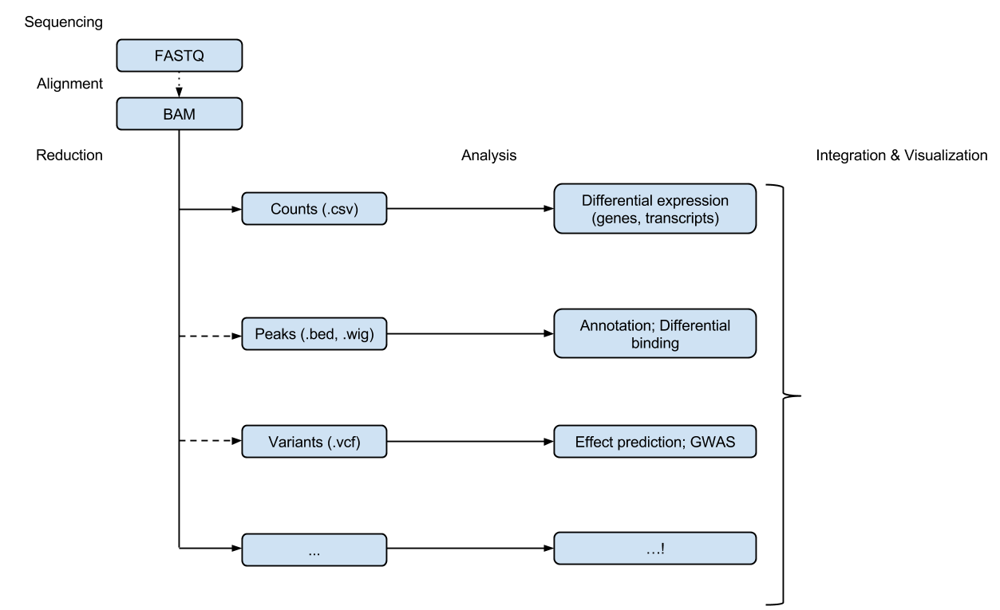
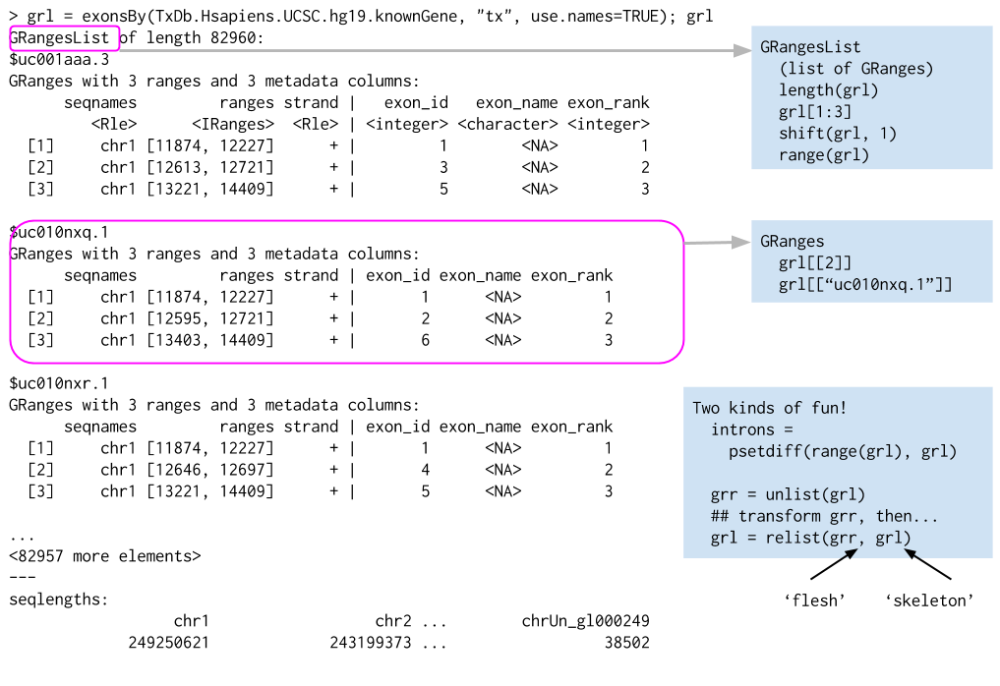

<!--
%\VignetteIndexEntry{01.3 Bioconductor for Sequence Analysis}
%\VignettePackage{LearnBioconductor}
%\VignetteEngine{knitr::knitr}
-->

```{r setup, echo=FALSE}
library(LearnBioconductor)
stopifnot(BiocInstaller::biocVersion() == "3.0")
```

```{r style, echo = FALSE, results = 'asis'}
BiocStyle::markdown()
knitr::opts_chunk$set(tidy=FALSE)
```

# Bioconductor for Sequence Analysis

Martin Morgan<br/>
October 29, 2014

## Sequence analysis work flows

1. Experimental design
   - Keep it simple, e.g., 'control' and 'treatment' groups
   - Replicate within treatments!
2. Wet-lab sequence preparation
   - Record covariates, including processing day -- likely 'batch effects'
3. (Illumina) Sequencing (Bentley et al., 2008,
   [doi:10.1038/nature07517](doi:10.1038/nature07517))
    
   - Primary output: FASTQ files of short reads and their [quality
     scores](http://en.wikipedia.org/wiki/FASTQ_format#Encoding)
4. Alignment
   - Choose to match task, e.g., [Rsubread][], Bowtie2 good for ChIPseq,
     some forms of RNAseq; BWA, GMAP better for variant calling
   - Primary output: BAM files of aligned reads
5. Reduction
   - e.g., RNASeq 'count table' (simple spreadsheets), DNASeq called
     variants (VCF files), ChIPSeq peaks (BED, WIG files)
6. Analysis
   - Differential expression, peak identification, ...
7. Comprehension
   - Biological context

Data movement



## Sequence data representations

### DNA / amino acid sequences: FASTA files

Input & manipulation: [Biostrings][]

    >NM_078863_up_2000_chr2L_16764737_f chr2L:16764737-16766736
    gttggtggcccaccagtgccaaaatacacaagaagaagaaacagcatctt
    gacactaaaatgcaaaaattgctttgcgtcaatgactcaaaacgaaaatg
    ...
    atgggtatcaagttgccccgtataaaaggcaagtttaccggttgcacggt
    >NM_001201794_up_2000_chr2L_8382455_f chr2L:8382455-8384454
    ttatttatgtaggcgcccgttcccgcagccaaagcactcagaattccggg
    cgtgtagcgcaacgaccatctacaaggcaatattttgatcgcttgttagg
    ...

Whole genomes: `2bit` and `.fa` formats: [rtracklayer][],
[Rsamtools][]; [BSgenome][]

### Reads: FASTQ files

Input & manipulation: [ShortRead][] `readFastq()`, `FastqStreamer()`,
`FastqSampler()`

    @ERR127302.1703 HWI-EAS350_0441:1:1:1460:19184#0/1
    CCTGAGTGAAGCTGATCTTGATCTACGAAGAGAGATAGATCTTGATCGTCGAGGAGATGCTGACCTTGACCT
    +
    HHGHHGHHHHHHHHDGG<GDGGE@GDGGD<?B8??ADAD<BE@EE8EGDGA3CB85*,77@>>CE?=896=:
    @ERR127302.1704 HWI-EAS350_0441:1:1:1460:16861#0/1
    GCGGTATGCTGGAAGGTGCTCGAATGGAGAGCGCCAGCGCCCCGGCGCTGAGCCGCAGCCTCAGGTCCGCCC
    +
    DE?DD>ED4>EEE>DE8EEEDE8B?EB<@3;BA79?,881B?@73;1?########################
        
- Quality scores: 'phred-like', encoded. See
  [wikipedia](http://en.wikipedia.org/wiki/FASTQ_format#Encoding)

### Aligned reads: BAM files (e.g., ERR127306_chr14.bam)

Input & manipulation: 'low-level' [Rsamtools][], `scanBam()`,
`BamFile()`; 'high-level' [GenomicAlignments][]

- Header

        @HD     VN:1.0  SO:coordinate
        @SQ     SN:chr1 LN:249250621
        @SQ     SN:chr10        LN:135534747
        @SQ     SN:chr11        LN:135006516
        ...
        @SQ     SN:chrY LN:59373566
        @PG     ID:TopHat       VN:2.0.8b       CL:/home/hpages/tophat-2.0.8b.Linux_x86_64/tophat --mate-inner-dist 150 --solexa-quals --max-multihits 5 --no-discordant --no-mixed --coverage-search --microexon-search --library-type fr-unstranded --num-threads 2 --output-dir tophat2_out/ERR127306 /home/hpages/bowtie2-2.1.0/indexes/hg19 fastq/ERR127306_1.fastq fastq/ERR127306_2.fastq
  
- Alignments: ID, flag, alignment and mate
  
        ERR127306.7941162       403     chr14   19653689        3       72M             =       19652348        -1413  ...
        ERR127306.22648137      145     chr14   19653692        1       72M             =       19650044        -3720  ...
        ERR127306.933914        339     chr14   19653707        1       66M120N6M       =       19653686        -213   ...
        ERR127306.11052450      83      chr14   19653707        3       66M120N6M       =       19652348        -1551  ...
        ERR127306.24611331      147     chr14   19653708        1       65M120N7M       =       19653675        -225   ...
        ERR127306.2698854       419     chr14   19653717        0       56M120N16M      =       19653935        290    ...
        ERR127306.2698854       163     chr14   19653717        0       56M120N16M      =       19653935        2019   ...
            
- Alignments: sequence and quality
        
        ... GAATTGATCAGTCTCATCTGAGAGTAACTTTGTACCCATCACTGATTCCTTCTGAGACTGCCTCCACTTCCC        *'%%%%%#&&%''#'&%%%)&&%%$%%'%%'&*****$))$)'')'%)))&)%%%%$'%%%%&"))'')%))
        ... TTGATCAGTCTCATCTGAGAGTAACTTTGTACCCATCACTGATTCCTTCTGAGACTGCCTCCACTTCCCCAG        '**)****)*'*&*********('&)****&***(**')))())%)))&)))*')&***********)****
        ... TGAGAGTAACTTTGTACCCATCACTGATTCCTTCTGAGACTGCCTCCACTTCCCCAGCAGCCTCTGGTTTCT        '******&%)&)))&")')'')'*((******&)&'')'))$))'')&))$)**&&****************
        ... TGAGAGTAACTTTGTACCCATCACTGATTCCTTCTGAGACTGCCTCCACTTCCCCAGCAGCCTCTGGTTTCT        ##&&(#')$')'%&&#)%$#$%"%###&!%))'%%''%'))&))#)&%((%())))%)%)))%*********
        ... GAGAGTAACTTTGTACCCATCACTGATTCCTTCTGAGACTGCCTCCACTTCCCCAGCAGCCTCTGGTTTCTT        )&$'$'$%!&&%&&#!'%'))%''&%'&))))''$""'%'%&%'#'%'"!'')#&)))))%$)%)&'"')))
        ... TTTGTACCCATCACTGATTCCTTCTGAGACTGCCTCCACTTCCCCAGCAGCCTCTGGTTTCTTCATGTGGCT        ++++++++++++++++++++++++++++++++++++++*++++++**++++**+**''**+*+*'*)))*)#
        ... TTTGTACCCATCACTGATTCCTTCTGAGACTGCCTCCACTTCCCCAGCAGCCTCTGGTTTCTTCATGTGGCT        ++++++++++++++++++++++++++++++++++++++*++++++**++++**+**''**+*+*'*)))*)#
        
- Alignments: Tags

        ... AS:i:0  XN:i:0  XM:i:0  XO:i:0  XG:i:0  NM:i:0  MD:Z:72 YT:Z:UU NH:i:2  CC:Z:chr22      CP:i:16189276   HI:i:0
        ... AS:i:0  XN:i:0  XM:i:0  XO:i:0  XG:i:0  NM:i:0  MD:Z:72 YT:Z:UU NH:i:3  CC:Z:=  CP:i:19921600   HI:i:0
        ... AS:i:0  XN:i:0  XM:i:0  XO:i:0  XG:i:0  NM:i:4  MD:Z:72 YT:Z:UU XS:A:+  NH:i:3  CC:Z:=  CP:i:19921465   HI:i:0
        ... AS:i:0  XN:i:0  XM:i:0  XO:i:0  XG:i:0  NM:i:4  MD:Z:72 YT:Z:UU XS:A:+  NH:i:2  CC:Z:chr22      CP:i:16189138   HI:i:0
        ... AS:i:0  XN:i:0  XM:i:0  XO:i:0  XG:i:0  NM:i:5  MD:Z:72 YT:Z:UU XS:A:+  NH:i:3  CC:Z:=  CP:i:19921464   HI:i:0
        ... AS:i:0  XM:i:0  XO:i:0  XG:i:0  MD:Z:72 NM:i:0  XS:A:+  NH:i:5  CC:Z:=  CP:i:19653717   HI:i:0
        ... AS:i:0  XM:i:0  XO:i:0  XG:i:0  MD:Z:72 NM:i:0  XS:A:+  NH:i:5  CC:Z:=  CP:i:19921455   HI:i:1

### Called variants: VCF files

Input and manipulation: [VariantAnnotation][] `readVcf()`,
`readInfo()`, `readGeno()` selectively with `ScanVcfParam()`.

- Header

          ##fileformat=VCFv4.2
          ##fileDate=20090805
          ##source=myImputationProgramV3.1
          ##reference=file:///seq/references/1000GenomesPilot-NCBI36.fasta
          ##contig=<ID=20,length=62435964,assembly=B36,md5=f126cdf8a6e0c7f379d618ff66beb2da,species="Homo sapiens",taxonomy=x>
          ##phasing=partial
          ##INFO=<ID=DP,Number=1,Type=Integer,Description="Total Depth">
          ##INFO=<ID=AF,Number=A,Type=Float,Description="Allele Frequency">
          ...
          ##FILTER=<ID=q10,Description="Quality below 10">
          ##FILTER=<ID=s50,Description="Less than 50% of samples have data">
          ...
          ##FORMAT=<ID=GT,Number=1,Type=String,Description="Genotype">
          ##FORMAT=<ID=GQ,Number=1,Type=Integer,Description="Genotype Quality">
          
- Location

          #CHROM POS     ID        REF    ALT     QUAL FILTER ...
          20     14370   rs6054257 G      A       29   PASS   ...
          20     17330   .         T      A       3    q10    ...
          20     1110696 rs6040355 A      G,T     67   PASS   ...
          20     1230237 .         T      .       47   PASS   ...
          20     1234567 microsat1 GTC    G,GTCT  50   PASS   ...
          
- Variant INFO

          #CHROM POS     ...	INFO                              ...
          20     14370   ...	NS=3;DP=14;AF=0.5;DB;H2           ...
          20     17330   ...	NS=3;DP=11;AF=0.017               ...
          20     1110696 ...	NS=2;DP=10;AF=0.333,0.667;AA=T;DB ...
          20     1230237 ...	NS=3;DP=13;AA=T                   ...
          20     1234567 ...	NS=3;DP=9;AA=G                    ...
    
- Genotype FORMAT and samples

          ... POS     ...  FORMAT      NA00001        NA00002        NA00003
          ... 14370   ...  GT:GQ:DP:HQ 0|0:48:1:51,51 1|0:48:8:51,51 1/1:43:5:.,.
          ... 17330   ...  GT:GQ:DP:HQ 0|0:49:3:58,50 0|1:3:5:65,3   0/0:41:3
          ... 1110696 ...  GT:GQ:DP:HQ 1|2:21:6:23,27 2|1:2:0:18,2   2/2:35:4
          ... 1230237 ...  GT:GQ:DP:HQ 0|0:54:7:56,60 0|0:48:4:51,51 0/0:61:2
          ... 1234567 ...  GT:GQ:DP    0/1:35:4       0/2:17:2       1/1:40:3
            
### Genome annotations: BED, WIG, GTF, etc. files

Input: [rtracklayer][] `import()`

- BED: range-based annotation (see
  http://genome.ucsc.edu/FAQ/FAQformat.html for definition of this and
  related formats)
- WIG / bigWig: dense, continuous-valued data
- GTF: gene model

  - Component coordinates
  
              7   protein_coding  gene        27221129    27224842    .   -   . ...
              ...
              7   protein_coding  transcript  27221134    27224835    .   -   . ...
              7   protein_coding  exon        27224055    27224835    .   -   . ...
              7   protein_coding  CDS         27224055    27224763    .   -   0 ...
              7   protein_coding  start_codon 27224761    27224763    .   -   0 ...
              7   protein_coding  exon        27221134    27222647    .   -   . ...
              7   protein_coding  CDS         27222418    27222647    .   -   2 ...
              7   protein_coding  stop_codon  27222415    27222417    .   -   0 ...
              7   protein_coding  UTR         27224764    27224835    .   -   . ...
              7   protein_coding  UTR         27221134    27222414    .   -   . ...
      
  - Annotations

              gene_id "ENSG00000005073"; gene_name "HOXA11"; gene_source "ensembl_havana"; gene_biotype "protein_coding";
              ...
              ... transcript_id "ENST00000006015"; transcript_name "HOXA11-001"; transcript_source "ensembl_havana"; tag "CCDS"; ccds_id "CCDS5411";
              ... exon_number "1"; exon_id "ENSE00001147062";
              ... exon_number "1"; protein_id "ENSP00000006015";
              ... exon_number "1";
              ... exon_number "2"; exon_id "ENSE00002099557";
              ... exon_number "2"; protein_id "ENSP00000006015";
              ... exon_number "2";
              ...

## Sequence data in _R_ / _Bioconductor_

### Role for Bioconductor

- Pre-processing and alignment
- Data reduction
- Statistical analysis
- Comprehension -- integrative and 'down stream' analysis


### Sequences

_Biostrings_ classes for DNA or amino acid sequences

- XString, XStringSet, e.g., DNAString (genomes),
  DNAStringSet (reads)

Methods

- [Cheat sheat](http://bioconductor.org/packages/release/bioc/vignettes/Biostrings/inst/doc/BiostringsQuickOverview.pdf)
- Manipulation, e.g., `reverseComplement()`
- Summary, e.g., `letterFrequency()`
- Matching, e.g., `matchPDict()`, `matchPWM()`

Related packages

- [BSgenome][]
    - Whole-genome representations
    - Model organism or custom
    - 'Masks' to exclude regions (pre-computed or arbitrary) from
      calculations
- [BSgenome][]: Whole-genome sequence representation & manipulation)
- [Rsamtools][]: `FaFile` class for indexed on-disk representation
- [rtracklayer][]: UCSC '2bit' (`TwoBitFile`) class for indexed
  on-disk representation

Example 

- Whole-genome sequences are distrubuted by ENSEMBL, NCBI, and others
  as FASTA files; model organism whole genome sequences are packaged
  into more user-friendly `BSgenome` packages. The following
  calculates GC content across chr14.

```{r BSgenome-require, message=FALSE}
suppressPackageStartupMessages({  
    library(BSgenome.Hsapiens.UCSC.hg19)
})
chr14_range = GRanges("chr14", IRanges(1, seqlengths(Hsapiens)["chr14"]))
chr14_dna <- getSeq(Hsapiens, chr14_range)
letterFrequency(chr14_dna, "GC", as.prob=TRUE)
```

### Ranges

Ranges represent:
- Data, e.g., aligned reads, ChIP peaks, SNPs, CpG islands, ...
- Annotations, e.g., gene models, regulatory elements, methylated
  regions
- Ranges are defined by chromosome, start, end, and strand
- Often, metadata is associated with each range, e.g., quality of
  alignment, strength of ChIP peak

Many common biological questions are range-based
- What reads overlap genes?
- What genes are ChIP peaks nearest?
- ...


The [GenomicRanges][] package defines essential classes and methods

- `GRanges`

    

- `GRangesList`

    

#### Range operations


Ranges
- IRanges
  - `start()` / `end()` / `width()`
  - List-like -- `length()`, subset, etc.
  - 'metadata', `mcols()`
- GRanges
  - 'seqnames' (chromosome), 'strand'
  - `Seqinfo`, including `seqlevels` and `seqlengths`

Intra-range methods
- Independent of other ranges in the same object
- GRanges variants strand-aware
- `shift()`, `narrow()`, `flank()`, `promoters()`, `resize()`,
  `restrict()`, `trim()`
- See `?"intra-range-methods"`

Inter-range methods
- Depends on other ranges in the same object
- `range()`, `reduce()`, `gaps()`, `disjoin()`
- `coverage()` (!)
- see `?"inter-range-methods"`

Between-range methods
- Functions of two (or more) range objects
- `findOverlaps()`, `countOverlaps()`, ..., `%over%`, `%within%`,
  `%outside%`; `union()`, `intersect()`, `setdiff()`, `punion()`,
  `pintersect()`, `psetdiff()`

Example

```{r ranges, message=FALSE}
suppressPackageStartupMessages({
    library(GenomicRanges)
})
gr <- GRanges("A", IRanges(c(10, 20, 22), width=5), "+")
shift(gr, 1)                            # 1-based coordinates!
range(gr)                               # intra-range
reduce(gr)                              # inter-range
coverage(gr)
setdiff(range(gr), gr)                  # 'introns'
```

IRangesList, GRangesList
- List: all elements of the same type
- Many *List-aware methods, but a common 'trick': apply a vectorized
  function to the unlisted representaion, then re-list

        grl <- GRangesList(...)
        orig_gr <- unlist(grl)
        transformed_gr <- FUN(orig)
        transformed_grl <- relist(, grl)
        
Reference

- Lawrence M, Huber W, Pagès H, Aboyoun P, Carlson M, et al. (2013)
  Software for Computing and Annotating Genomic Ranges. PLoS Comput
  Biol 9(8): e1003118. doi:10.1371/journal.pcbi.1003118

### [GenomicAlignments][] (Aligned reads)

Classes -- GenomicRanges-like behaivor

- GAlignments, GAlignmentPairs, GAlignmentsList
- SummarizedExperiment
  - Matrix where rows are indexed by genomic ranges, columns by a
    DataFrame.

Methods

- `readGAlignments()`, `readGAlignmentsList()`
  - Easy to restrict input, iterate in chunks
- `summarizeOverlaps()`

Example

- Find reads supporting the junction identified above, at position
  19653707 + 66M = 19653773 of chromosome 14

```{r bam-require}
suppressPackageStartupMessages({
    library(GenomicRanges)
    library(GenomicAlignments)
    library(Rsamtools)
})

## our 'region of interest'
roi <- GRanges("chr14", IRanges(19653773, width=1)) 
## sample data
suppressPackageStartupMessages({
    library('RNAseqData.HNRNPC.bam.chr14')
})
bf <- BamFile(RNAseqData.HNRNPC.bam.chr14_BAMFILES[[1]], asMates=TRUE)
## alignments, junctions, overlapping our roi
paln <- readGAlignmentsList(bf)
j <- summarizeJunctions(paln, with.revmap=TRUE)
j_overlap <- j[j %over% roi]

## supporting reads
paln[j_overlap$revmap[[1]]]
```
  
### [VariantAnnotation][] (called variants)

Classes -- GenomicRanges-like behavior

- VCF -- 'wide'
- VRanges -- 'tall'

Functions and methods

- I/O and filtering: `readVcf()`, `readGeno()`, `readInfo()`,
  `readGT()`, `writeVcf()`, `filterVcf()`
- Annotation: `locateVariants()` (variants overlapping ranges),
  `predictCoding()`, `summarizeVariants()`
- SNPs: `genotypeToSnpMatrix()`, `snpSummary()`

Example

- Read variants from a VCF file, and annotate with respect to a known
  gene model
  
```{r vcf, message=FALSE}
## input variants
suppressPackageStartupMessages({
    library(VariantAnnotation)
})
fl <- system.file("extdata", "chr22.vcf.gz", package="VariantAnnotation")
vcf <- readVcf(fl, "hg19")
seqlevels(vcf) <- "chr22"
## known gene model
suppressPackageStartupMessages({
   library(TxDb.Hsapiens.UCSC.hg19.knownGene)
})
coding <- locateVariants(rowData(vcf),
    TxDb.Hsapiens.UCSC.hg19.knownGene,
    CodingVariants())
head(coding)
```

Related packages

- [ensemblVEP][] 
  - Forward variants to Ensembl Variant Effect Predictor
- [VariantTools][], [h5vc][]
  - Call variants
- [VariantFiltering][]
  - Filter variants using criteria such as coding consequence, MAF,
    ..., inheritance model

Reference

- Obenchain, V, Lawrence, M, Carey, V, Gogarten, S, Shannon, P, and
  Morgan, M. VariantAnnotation: a Bioconductor package for exploration
  and annotation of genetic variants. Bioinformatics, first published
  online March 28, 2014
  [doi:10.1093/bioinformatics/btu168](http://bioinformatics.oxfordjournals.org/content/early/2014/04/21/bioinformatics.btu168)

### [rtracklayer][] (Genome annotations)

- Import BED, GTF, WIG, etc
- Export GRanges to BED, GTF, WIG, ...
- Access UCSC genome browser

## A sequence analysis package tour

This very open-ended topic points to some of the most prominent
Bioconductor packages for sequence analysis. Use the opportunity in
this lab to explore the package vignettes and help pages highlighted
below; many of the material will be covered in greater detail in
subsequent labs and lectures.

Basics 

- Bioconductor packages are listed on the [biocViews][] page. Each
  package has 'biocViews' (tags from a controlled vocabulary)
  associated with it; these can be searched to identify appropriately
  tagged packages, as can the package title and author.
- Each package has a 'landing page', e.g., for
  [GenomicRanges][]. Visit this landing page, and note the
  description, authors, and installation instructions. Packages are
  often written up in the scientific literature, and if available the
  corresponding citation is present on the landing page. Also on the
  landing page are links to the vignettes and reference manual and, at
  the bottom, an indication of cross-platform availability and
  download statistics.
-   A package needs to be installed once, using the instructions on the
    landing page. Once installed, the package can be loaded into an R
    session

    ```{r require}
    suppressPackageStartupMessages({
        library(GenomicRanges)
    })
    ```
    
    and the help system queried interactively, as outlined above:

    ```{r help, eval=FALSE}
      help(package="GenomicRanges")
      vignette(package="GenomicRanges")
      vignette(package="GenomicRanges", "GenomicRangesHOWTOs")
      ?GRanges
    ```
    
Domain-specific analysis -- explore the landing pages, vignettes, and
reference manuals of two or three of the following packages.

- Important packages for analysis of differential expression include
  [edgeR][] and [DESeq2][]; both have excellent vignettes for
  exploration. Additional research methods embodied in Bioconductor
  packages can be discovered by visiting the [biocViews][] web page,
  searching for the 'DifferentialExpression' view term, and narrowing
  the selection by searching for 'RNA seq' and similar.
- Popular ChIP-seq packages include [DiffBind][] for comparison of
  peaks across samples, [ChIPQC][] for quality assessment, and
  [ChIPpeakAnno][] for annotating results (e.g., discovering nearby
  genes). What other ChIP-seq packages are listed on the [biocViews][]
  page?
- Working with called variants (VCF files) is facilitated by packages
  such as [VariantAnnotation][], [VariantFiltering][], [ensemblVEP][],
  and [SomaticSignatures][]; packages for calling variants include,
  e.g., [h5vc][] and [VariantTools][].
- Several packages identify copy number variants from sequence data,
  including [cn.mops][]; from the [biocViews][] page, what other copy
  number packages are available? The [CNTools][] package provides some
  useful facilities for comparison of segments across samples.
- Microbiome and metagenomic analysis is facilitated by packages such
  as [phyloseq][] and [metagenomeSeq][].
- Metabolomics, chemoinformatics, image analysis, and many other
  high-throughput analysis domains are also represented in
  Bioconductor; explore these via biocViews and title searches.
  
Working with sequences, alignments, common web file formats, and raw
data; these packages rely very heavily on the [IRanges][] /
[GenomicRanges][] infrastructure that we will encounter later in the
course.

- The [Biostrings][] package is used to represent DNA and other
  sequences, with many convenient sequence-related functions. Check
  out the functions documented on the help page `?consensusMatrix`,
  for instance. Also check out the [BSgenome][] package for working
  with whole genome sequences, e.g., `?"getSeq,BSgenome-method"`
- The [GenomicAlignments][] package is used to input reads aligned to
  a reference genome. See for instance the `?readGAlignments` help
  page and `vigentte(package="GenomicAlignments",
  "summarizeOverlaps")`
- [rtracklayer][]'s `import` and `export` functions can read in many
  common file types, e.g., BED, WIG, GTF, ..., in addition to querying
  and navigating the UCSC genome browser. Check out the `?import` page
  for basic usage.
- The [ShortRead][] and [Rsamtools][] packages can be used for
  lower-level access to FASTQ and BAM files, respectively. Explore the
  [ShortRead vignette](http://bioconductor.org/packages/release/bioc/vignettes/ShortRead/inst/doc/Overview.pdf)
  and Scalable Genomics labs to see approaches to effectively
  processing the large files.

Visualization

- The [Gviz][] package provides great tools for visualizing local
  genomic coordinates and associated data. 
- [epivizr][] drives the [epiviz](http://epiviz.cbcb.umd.edu/) genome
  browser from within R; [rtracklayer][] provides easy ways to
  transfer data to and manipulate UCSC browser sessions.
- Additionl packages include [ggbio][], [OmicCircos][], ...

## Lab

### Short read quality assessment

`fastqc` is a Java program commonly used for summarizing quality of
fastq files. It has a straight-forward graphical user interface. Here
we will use the command-line version.

1. From within _Rstudio_, choose 'Tools --> Shell...', or log on to
   your Amazon machine instance using a Mac / linux terminal or on
   Windows the PuTTY program.

2. Run fastqc on sample fastq files, sending the output to the
   `~/fastqc_report` directory.

        fastqc fastq/*fastq --threads 8 --outdir=fastqc_reports

3. Study the quality report and resulting on-line [documentation](FIXME):
   In the Files tab, click on `fastqc_reports`. Click on the HTML file 
   there and then click on "View in Web Browser".

`r Biocpkg("ShortRead")` provides similar functionality, but from
within _R_. The following shows that _R_ can handle large data, and
illustrates some of the basic ways in which one might interact with
functionality provided by a _Bioconductor_ package.

```{r ShortRead, messages=FALSE}
## 1. attach ShortRead and BiocParallel
suppressPackageStartupMessages({
    library(ShortRead)
    library(BiocParallel)
})

## 2. create a vector of file paths
fls <- dir("~/fastq", pattern="*fastq", full=TRUE)

```

```{r fakestats, eval=FALSE}
## 3. collect statistics
stats0 <- qa(fls)
```

```{r realstats, echo=FALSE, results="hide"}
data(stats0)
```

```{r browseStats}
## 4. generate and browse the report
if (interactive())
    browseURL(report(stats0))
```

Check out the qa report from all lanes

```{r ShortRead-qa-all}
data(qa_all)
if (interactive())
    browseURL(report(qa_all))
```

### Alignments (and genomic annotations)

This data is from the `r Biocannopkg("airway")` Bioconductor
annotation package; see the
[vignette](http://bioconductor.org/packages/release/data/experiment/vignettes/airway/inst/doc/airway.html)
for details

Integrative Genomics Viewer

1. Start IGV and select the "hg19" genome.

2. The sequence names used in the reference genome differ from those
   used by IGV to represent the identical genome. We need to map
   between these different sequence names, following the instructions
   for
   [Creating a Chromosome Name Alias File](http://www.broadinstitute.org/software/igv/LoadData/#aliasfile).

   Copy the file `hg19_alias.tab` from the location specified in class
   into the directory `<user_home>/igv/genomes/`. Restart IGV.

3. Start igv.

4. Choose hg19 from the drop-down menu at the top left of
   the screen

5. Use `File -> Load from URL` menu to load a bam file. The URLs will
   be provided during class.

6. Zoom in to a particular gene, e.g., SPARCL1, by entering the gene
   symbol in the box toward the center of the browser window. Adjust
   the zoom until reads come in to view, and interpret the result.

_Bioconductor_: we'll explore how to map between different types of
identifiers, how to navigate genomic coordinates, and how to query BAM
files for aligned reads.

1. Attach 'Annotation' packages containing information about gene
   symbols `r Biocannopkg("org.Hs.eg.db")` and genomic coordinates
   (e.g., genes, exons, cds, transcripts) `r
   Biocannopkg(TxDb.Hsapiens.UCSC.hg19.knownGene)`. Arrange for the
   'seqlevels' (chromosome names) in the TxDb package to match those
   in the BAM files.

2. Use an appropriate `org.*` package to map from gene symbol to
   Entrez gene id, and the appropriate `TxDb.*` package to retrieve
   gene coordinates of the SPARCL1 gene. N.B. -- The following uses a
   single gene symbol, but we could have used 1, 2, or all gene
   symbols in a _vectorized_ fashion.

3. Attach the `r Biocpkg("GenomicAlignments")` package for working
   with aligned reads. Use `range()` to get the genomic coordinates
   spanning the first and last exon of SPARCL1. Input paired reads
   overlapping SPARCL1.

4. What questions can you easily answer about these alignments? E.g.,
   how many reads overlap this region of interest?

    ```{r setup-view, message=FALSE, warning=FALSE}
    ## 1.a 'Annotation' packages
    suppressPackageStartupMessages({
        library(TxDb.Hsapiens.UCSC.hg19.knownGene)
        library(org.Hs.eg.db)
    })
    
    ## 1.b -- map 'seqlevels' as recorded in the TxDb file to those in the
    ## BAM file
    fl <- "~/igv/genomes/hg19_alias.tab"
    map <- with(read.delim(fl, header=FALSE, stringsAsFactors=FALSE),
        setNames(V1, V2))
    seqlevels(TxDb.Hsapiens.UCSC.hg19.knownGene, force=TRUE) <- map
    
    ## 2. Symbol -> Entrez ID -> Gene coordinates
    sym2eg <- select(org.Hs.eg.db, "SPARCL1", "ENTREZID", "SYMBOL")
    exByGn <- exonsBy(TxDb.Hsapiens.UCSC.hg19.knownGene, "gene")
    sparcl1exons <- exByGn[[sym2eg$ENTREZID]]
    
    ## 3. Aligned reads
    suppressPackageStartupMessages({
        library(GenomicAlignments)
    })
    
    fl <- "~/bam/SRR1039508_sorted.bam"
    sparcl1gene <- range(sparcl1exons)
    param <- ScanBamParam(which=sparcl1gene)
    aln <- readGAlignmentPairs(fl, param=param)
    ```
    
5. As another exercise we ask how many of the reads we've input are
   compatible with the known gene model. We have to find the
   transcripts that belong to our gene, and then exons grouped by
   transcript

    ```{r compatibleAlignments, warning=FALSE}
    ## 5.a. exons-by-transcript for our gene of interest
    txids <- select(TxDb.Hsapiens.UCSC.hg19.knownGene, sym2eg$ENTREZID,
        "TXID", "GENEID")$TXID
    exByTx <- exonsBy(TxDb.Hsapiens.UCSC.hg19.knownGene, "tx")[txids]
    
    ## 5.b compatible alignments
    hits <- findCompatibleOverlaps(query=aln, subject=exByTx)
    good <- seq_along(aln) %in% queryHits(hits)
    table(good)
    ```
    
6. Finally, let's go from gene model to protein coding
   sequence. (a) Extract CDS regions grouped by transcript, select just
   transcripts we're interested in, (b) attach and then extract the coding
   sequence from the appropriate reference genome. Translating the
   coding sequences to proteins.

    ```{r coding-sequence, warning=FALSE}
    ## reset seqlevels
    restoreSeqlevels(TxDb.Hsapiens.UCSC.hg19.knownGene)
    
    ## a. cds coordinates, grouped by transcript
    txids <- select(TxDb.Hsapiens.UCSC.hg19.knownGene, sym2eg$ENTREZID,
        "TXID", "GENEID")$TXID
    cdsByTx <- cdsBy(TxDb.Hsapiens.UCSC.hg19.knownGene, "tx")[txids]
    
    ## b. coding sequence from relevant reference genome
    suppressPackageStartupMessages({
        library(BSgenome.Hsapiens.UCSC.hg19)
    })
    
    dna <- extractTranscriptSeqs(BSgenome.Hsapiens.UCSC.hg19, cdsByTx)
    protein <- translate(dna)
    ```

### Working with genomic ranges

Visit the "GenomicRanges HOWTOs" vignette. 

```{r GenomicRanges-howtos, eval=FALSE}
browseVignettes("GenomicRanges")
```

Read section 1, and
do exercises 2.2, 2.4, 2.5, 2.8, 2.12, and 2.13. Perhaps select
additional topics of particular interest to you.

## Resources

_R_ / _Bioconductor_

- [Web site][Bioconductor] -- install, learn, use, develop _R_ /
  _Bioconductor_ packages
- [Support](http://support.bioconductor.org) -- seek help and
  guidance; also
  [StackOverflow](http://stackoverflow.com/questions/tagged/r) for _R_
  programming questions
- [biocViews](http://bioconductor.org/packages/release/BiocViews.html)
  -- discover packages
- Package landing pages, e.g.,
  [GenomicRanges](http://bioconductor.org/packages/release/bioc/html/GenomicRanges.html),
  including title, description, authors, installation instructions,
  vignettes (e.g., GenomicRanges '[How
  To](http://bioconductor.org/packages/release/bioc/vignettes/GenomicRanges/inst/doc/GenomicRangesHOWTOs.pdf)'),
  etc.
- [Course](http://bioconductor.org/help/course-materials/) and other
  [help](http://bioconductor.org/help/) material (e.g., videos, EdX
  course, community blogs, ...)

Publications and presentations

- Lawrence M, Huber W, Pagès H, Aboyoun P, Carlson M, et al. (2013)
  Software for Computing and Annotating Genomic Ranges. PLoS Comput
  Biol 9(8): e1003118. doi:
  [10.1371/journal.pcbi.1003118][GRanges.bib]

- Lawrence, M. 2014. Software for Enabling Genomic Data
  Analysis. Bioc2014 conference [slides](http://bioconductor.org/help/course-materials/2014/BioC2014/Lawrence_Talk.pdf).

<!-- Bibliography -->

[R]: http://r-project.org
[Bioconductor]: http://bioconductor.org
[GRanges.bib]: http://dx.doi.org/10.1371/journal.pcbi.1003118
[Scalable.bib]: http://arxiv.org/abs/1409.2864
[Lawrence.bioc2014.bib]:
    http://bioconductor.org/help/course-materials/2014/BioC2014/Lawrence_Talk.pdf


[AnnotationData]: http://bioconductor.org/packages/release/BiocViews.html#___AnnotationData
[AnnotationDbi]: http://bioconductor.org/packages/release/bioc/html/AnnotationDbi.html
[AnnotationHub]: http://bioconductor.org/packages/release/bioc/html/AnnotationHub.html
[BSgenome.Hsapiens.UCSC.hg19]: http://bioconductor.org/packages/release/data/annotation/html/BSgenome.Hsapiens.UCSC.hg19.html
[BSgenome]: http://bioconductor.org/packages/release/bioc/html/BSgenome.html
[Biostrings]: http://bioconductor.org/packages/release/bioc/html/Biostrings.html
[Bsgenome.Hsapiens.UCSC.hg19]: http://bioconductor.org/packages/release/data/annotation/html/Bsgenome.Hsapiens.UCSC.hg19.html
[CNTools]: http://bioconductor.org/packages/release/bioc/html/CNTools.html
[ChIPQC]: http://bioconductor.org/packages/release/bioc/html/ChIPQC.html
[ChIPpeakAnno]: http://bioconductor.org/packages/release/bioc/html/ChIPpeakAnno.html
[DESeq2]: http://bioconductor.org/packages/release/bioc/html/DESeq2.html
[DiffBind]: http://bioconductor.org/packages/release/bioc/html/DiffBind.html
[GenomicAlignments]: http://bioconductor.org/packages/release/bioc/html/GenomicAlignments.html
[GenomicRanges]: http://bioconductor.org/packages/release/bioc/html/GenomicRanges.html
[Homo.sapiens]: http://bioconductor.org/packages/release/data/annotation/html/Homo.sapiens.html
[IRanges]: http://bioconductor.org/packages/release/bioc/html/IRanges.html
[KEGGREST]: http://bioconductor.org/packages/release/bioc/html/KEGGREST.html
[PSICQUIC]: http://bioconductor.org/packages/release/bioc/html/PSICQUIC.html
[Rsamtools]: http://bioconductor.org/packages/release/bioc/html/Rsamtools.html
[Rsubread]: http://bioconductor.org/packages/release/bioc/html/Rsubread.html
[ShortRead]: http://bioconductor.org/packages/release/bioc/html/ShortRead.html
[SomaticSignatures]: http://bioconductor.org/packages/release/bioc/html/SomaticSignatures.html
[TxDb.Hsapiens.UCSC.hg19.knownGene]: http://bioconductor.org/packages/release/data/annotation/html/TxDb.Hsapiens.UCSC.hg19.knownGene.html
[VariantAnnotation]: http://bioconductor.org/packages/release/bioc/html/VariantAnnotation.html
[VariantFiltering]: http://bioconductor.org/packages/release/bioc/html/VariantFiltering.html
[VariantTools]: http://bioconductor.org/packages/release/bioc/html/VariantTools.html
[biocViews]: http://bioconductor.org/packages/release/BiocViews.html#___Software
[biomaRt]: http://bioconductor.org/packages/release/bioc/html/biomaRt.html
[cn.mops]: http://bioconductor.org/packages/release/bioc/html/cn.mops.html
[edgeR]: http://bioconductor.org/packages/release/bioc/html/edgeR.html
[ensemblVEP]: http://bioconductor.org/packages/release/bioc/html/ensemblVEP.html 
[h5vc]: http://bioconductor.org/packages/release/bioc/html/h5vc.html
[limma]: http://bioconductor.org/packages/release/bioc/html/limma.html
[metagenomeSeq]: http://bioconductor.org/packages/release/bioc/html/metagenomeSeq.html
[org.Hs.eg.db]: http://bioconductor.org/packages/release/data/annotation/html/org.Hs.eg.db.html
[org.Sc.sgd.db]: http://bioconductor.org/packages/release/data/annotation/html/org.Sc.sgd.db.html
[phyloseq]: http://bioconductor.org/packages/release/bioc/html/phyloseq.html
[rtracklayer]: http://bioconductor.org/packages/release/bioc/html/rtracklayer.html
[snpStats]: http://bioconductor.org/packages/release/bioc/html/snpStats.html
[Gviz]: http://bioconductor.org/packages/release/bioc/html/Gviz.html
[epivizr]: http://bioconductor.org/packages/release/bioc/html/epivizr.html
[ggbio]: http://bioconductor.org/packages/release/bioc/html/ggbio.html
[OmicCircos]: http://bioconductor.org/packages/release/bioc/html/OmicCircos.html
