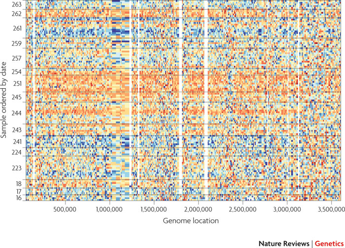
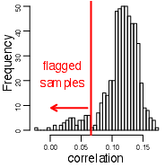

<!--
%\VignetteIndexEntry{02.1 RNA-Seq Work Flows}
%\VignettePackage{LearnBioconductor}
%\VignetteEngine{knitr::knitr}
-->

```{r style, echo = FALSE, results = 'asis'}
BiocStyle::markdown()
knitr::opts_chunk$set(tidy=FALSE)
```

```{r setup, echo=FALSE}
library(LearnBioconductor)
stopifnot(BiocInstaller::biocVersion() == "3.0")
```

# RNA-Seq Work Flows

Martin Morgan, Sonali Arora<br/>
October 28, 2014

## 7-step work flow


### 1. Experimental design

Keep it simple

- Classical experimental designs
- Time series
- Without missing values, where possible
- Intended analysis must be feasbile -- can the available samples and
  hypothesis of interest be combined to formulate a testable
  statistical hypothesis?

Replicate

- Extent of replication determines nuance of biological question.
- No replication (1 sample per treatment): qualitative description
  with limited statistical options.
- 3-5 replicates per treatment: designed experimental manipulation
  with cell lines or other well-defined entities; 2-fold (?)
  change in average expression between groups.
- 10-50 replicates per treatment: population studies, e.g., cancer
  cell lines.
- 1000's of replicates: prospective studies, e.g., SNP discovery
- One resource: `r Biocpkg("RNASeqPower")`

Avoid confounding experimental factors with other factors

- Common problems: samples from one treatment all on the same flow
  cell; samples from treatment 1 processed first, treatment 2
  processed second, etc.

Record co-variates
       
Be aware of _batch effects_

- Leek et al., 2010, Nature Reviews Genetics 11
  [733-739](http://www.nature.com/nrg/journal/v11/n10/abs/nrg2825.html),
  Leek & Story PLoS Genet 3(9):
  [e161](http://dx.doi.org/10.1371/journal.pgen.0030161).
- Scientific finding: pervasive batch effects
- Statistical insights: surrogate variable analysis: identify and
  build surrogate variables; remove known batch effects
- Benefits: reduce dependence, stabilize error rate estimates, and
  improve reproducibility
- _combat_ software / `r Biocpkg("sva")` _Bioconductor_ package 

   
  HapMap samples from one facility, ordered by date of processing.

### 2. Wet-lab

Confounding factors

- Record or avoid

Artifacts of your _particular_ protocols

- Sequence contaminants
- Enrichment bias, e.g., non-uniform transcript representation.
- PCR artifacts -- adapter contaminants, sequence-specific
  amplification bias, ...

### 3. Sequencing

Axes of variation

- Single- versus paired-end
- Length: 50-200nt
- Number of reads per sample

Application-specific, e.g.,

- ChIP-seq: short, single-end reads are usually sufficient
- RNA-seq, known genes: single- or  paired-end reads
- RNA-seq, transcripts or novel variants: paired-end reads
- Copy number: single- or paired-end reads
- Structural variants: paired-end reads
- Variants: depth via longer, paired-end reads
- Microbiome: long paired-end reads (overlapping ends)

### 4. Alignment

Alignment strategies

- _de novo_
  - No reference genome; considerable sequencing and computational
    resources
- Genome
  - Established reference genome
  - Splice-aware aligners
  - Novel transcript discovery
- Transcriptome
  - Established reference genome; reliable gene model
  - Simple aligners
  - Known gene / transcript expression

Splice-aware aligners (and _Bioconductor_ wrappers)

- [Bowtie2][] (`r Biocpkg("Rbowtie")`)
- [STAR][] ([doi](http://dx.doi.org/10.1093/bioinformatics/bts635))
- [GMAP/GSNAP][] (`r Biocpkg("gmapR")`)
- subread ([doi](http://dx.doi.org/10.1093/nar/gkt214))
  (`r Biocpkg("Rsubread")`)
- Systematic evaluation (Engstrom et al., 2013,
  [doi](http://dx.doi.org/10.1038/nmeth.2722))

### (5a. Bowtie2 / tophat / Cufflinks / Cuffdiff)

- [tophat][] uses [Bowtie2][] to perform basic single- and paired-end
  alignments, then uses algorithms to place difficult-to-align reads
  near to their well-aligned mates.
- [Cufflinks][] ([doi](http://dx.doi.org/10.1038/nprot.2012.016))
  takes _tophat_ output and estimate existing and novel transcript
  abundance.
  [How Cufflinks Works](http://cufflinks.cbcb.umd.edu/howitworks.html)
- [Cuffdiff][] assesses statistical significance of estimated
  abundances between experimental groups

### 5. Reduction to 'count tables'

- Use known gene model to count aligned reads overlapping regions of
  interest / gene models
- Gene model can be public (e.g., UCSC, NCBI, ENSEMBL) or _ad hoc_ (gff file)
- `GenomicAlignments::summarizeOverlaps()`
- [HTSeq](http://www-huber.embl.de/users/anders/HTSeq/doc/overview.html),
  [htseq-count](http://www-huber.embl.de/users/anders/HTSeq/doc/count.html)

### Step 6. Analysis

Summarization

- Counts _per se_, rather than a summary (RPKM, FRPKM, ...), are
  relevant for analysis
  - For a given gene, larger counts imply more information; RPKM etc.,
    treat all estimates as equally informative.
  - Comparison is across samples at _each_ region of interest; all
    samples have the same region of interest, so modulo library size
    there is no need to correct for, e.g., gene length or mapability.

Normalization

- Libraries differ in size (total counted reads per sample) for
  un-interesting reasons; we need to account for differences in
  library size in statistical analysis.
- Total number of counted reads per sample is _not_ a good estimate of
  library size. It is un-necessarily influenced by regions with large
  counts, and can introduce bias and correlation across
  genes. Instead, use a robust measure of library size that takes
  account of skew in the distribution of counts (simplest: trimmed
  geometric mean; more advanced / appropriate encountered in the lab).
- Library size (total number of counted reads) differs between
  samples, and should be included _as a statistical offset_ in
  analysis of differential expression, rather than 'dividing by' the
  library size early in an analysis.

Appropriate error model

- Count data is _not_ distributed normally or as a Poisson process,
  but rather as negative binomial. 
- Result of a combination Poisson (`shot' noise, i.e., within-sample
  technical and sampling variation in read counts) with variation
  between biological samples.
- A negative binomial model requires estimation of an additional
  parameter ('dispersion'), which is estimated poorly in small
  samples.
- Basic strategy is to moderate per-gene estimates with more robust
  local estimates derived from genes with similar expression values (a
  little more on borrowing information is provided below).

Pre-filtering

- Naively, a statistical test (e.g., t-test) could be applied to each
  row of a counts table. However, we have relatively few samples
  (10's) and very many comparisons (10,000's) so a naive approach is
  likely to be very underpowered, resulting in a very high _false
  discovery rate_
- A simple approach is perform fewer tests by removing regions that
  could not possibly result in statistical significance, regardless of
  hypothesis under consideration.
- Example: a region with 0 counts in all samples could not possibly be
  significant regradless of hypothesis, so exclude from further
  analysis.
- Basic approaches: 'K over A'-style filter -- require a minimum of A
  (normalized) read counts in at least K samples. Variance filter,
  e.g., IQR (inter-quartile range) provides a robust estimate of
  variability; can be used to rank and discard least-varying regions.
- More nuanced approaches: `r Biocpkg("edgeR")` vignette; work flow
  today.

Borrowing information

- Why does low statistical power elevate false discovery rate?
- One way of developing intuition is to recognize a t-test (for
  example) as a ratio of variances. The numerator is
  treatment-specific, but the denominator is a measure of overall
  variability.
- Variances are measured with uncertainty; over- or under-estimating
  the denominator variance has an asymmetric effect on a t-statistic
  or similar ratio, with an underestimate _inflating_ the statistic
  more dramatically than an overestimate deflates the statistic. Hence
  elevated false discovery rate.
- Under the typical null hypothesis used in microarray or RNA-seq
  experiments, each gene may respond differently to the treatment
  (numerator variance) but the overall variability of a gene is
  the same, at least for genes with similar average expression
- The strategy is to estimate the denominator variance as the
  between-group variance for the gene, _moderated_ by the average
  between-group variance across all genes.
- This strategy exploits the fact that the same experimental design
  has been applied to all genes assayed, and is effective at
  moderating false discovery rate.

### Step 7. Comprehension

Placing differentially expressed regions in context

- Gene names associated with genomic ranges
- Gene set enrichment and similar analysis
- Proximity to regulatory marks
- Integrate with other analyses, e.g., methylation, copy number,
  variants, ...
  
  
  Correlation between genomic copy number and mRNA expression
  identified 38 mis-labeled samples in the TCGA ovarian cancer
  Affymetrix microarray dataset.

## Lab

[The lab](B02.1.1_RNASeqLab.html) is based on a modified version of the
RNA-seq work flow developed by Michael Love, Simon Anders, Wolfgang
Huber.


[Bowtie2]: http://bowtie-bio.sourceforge.net/bowtie2/index.shtml
[tophat]: http://ccb.jhu.edu/software/tophat/index.shtml 
[Cufflinks]: http://cufflinks.cbcb.umd.edu/

[RSEM]: http://deweylab.biostat.wisc.edu/rsem/
[STAR]: https://github.com/alexdobin/STAR
[GMAP/GSNAP]: http://research-pub.gene.com/gmap/
