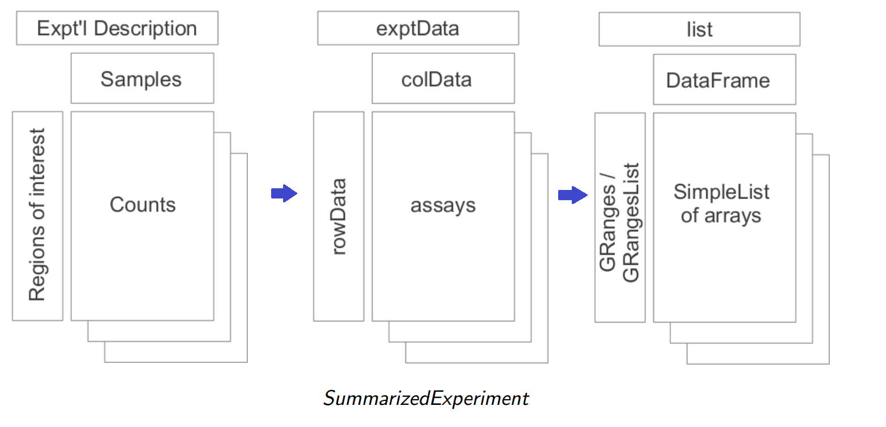
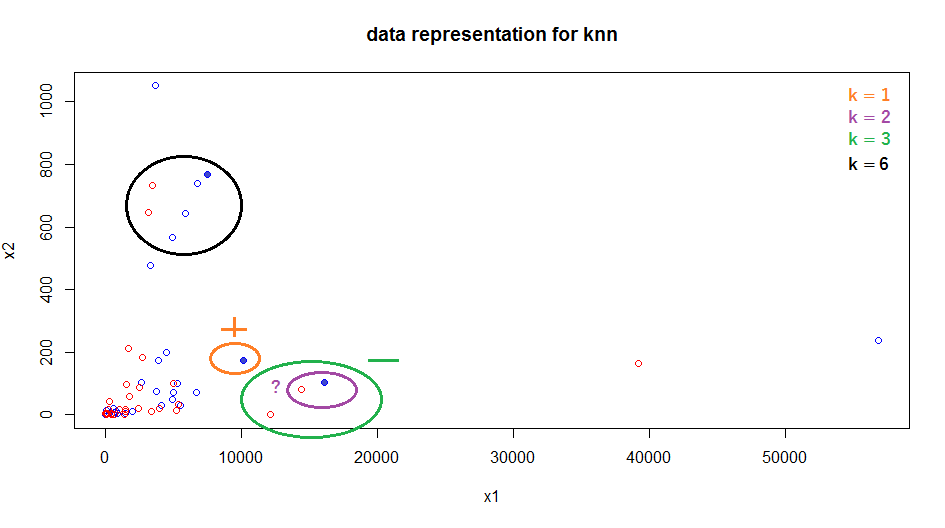
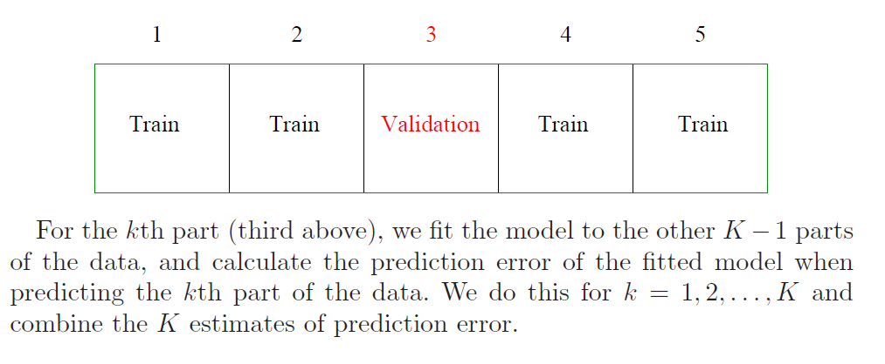

<!--
%\VignetteIndexEntry{02.3 Machine Learning}
%\VignettePackage{LearnBioconductor}
%\VignetteEngine{knitr::knitr}
-->

```{r style, echo = FALSE, results = 'asis'}
BiocStyle::markdown()
knitr::opts_chunk$set(cache=TRUE, tidy=FALSE)
```

```{r setup, echo=FALSE}
library(LearnBioconductor)
library(xtable)
stopifnot(BiocInstaller::biocVersion() == "3.0")
```

# Machine Learning 

Sonali Arora <br/>
28 October, 2014

## Introduction 

Statistical Learning plays an important role in Genomics. A few example of 
learning problems would be - 
* Identify the risk factors(genes) for prostrate cancer based on gene
  expression data
* Predict the chances of breast cancer survival in a patient. 
* Identify patterns of gene expression among different sub types of
  breast cancer

Typically, we have an outcome measurement, usually quantitative (such as gene
expression) or categorical (such as breast cancer /no breast cancer), that we 
wish to predict based on a set of features (such as diet and clinical 
measurements). We have a training set of data, in which we observe the outcome 
and feature measurements for a set of objects (such as people). With this data
we build a prediction model, or a learner, which will enable us to predict
the outcome for new unseen objects. A good learner is one that accurately
predicts such an outcome. This is called _supervised_ learning because the 
outcome variable guides the learning process. In the _unsupervised_ learning 
problem, have no measurements of the outcome and observe only the features. 
Our task is to describe how the data are organized or clustered. 

## Machine Learning with Bioconductor : Resources Overview 

Bioconductor houses a lot of R packages which provide machine learning tools for 
different kinds of Genomic Data analysis. It has had many releases since its 
inception. The latest cutting edge development happens in the "devel" version. 
One can find R packages specially catered to Machine Learning for Genomic 
Analysis by visiting the following link and using _biocViews_

http://www.bioconductor.org/packages/devel/BiocViews.html#___Software.

For example, one can type "Clustering" in the "Autocomplete biocViews search" 
box and find that there are 89 packages in Bioconductor which provide 
"Clustering" functionality for Genomic Data. On the same page, under 
"StatisticalMethod" one can find R packages for other machine learning 
techniques -

```{r echo=FALSE, results='asis'}
biocView_df <- data.frame( technique=c("Bayesian","Classification","Clustering"
    ,"DecisionTree","NeuralNetwork","SupportVectorMachines","DimensionReduction",
    "HiddenMarkovModel","Regression","PrincipalComponent"), packages = 
    as.integer(c(15, 64, 89, 7, 1, 1, 2, 4, 7, 4)))
print(xtable(biocView_df), type="html", comment=FALSE)
```

## Data for this Lab 

We will use two data sets in this lab - one for supervised learning and one for 
unsupervised learning. 

For **Unsupervised learning**, we will use the NCI60 cancer cell 
microarray data which contains 6830 gene expression measurements of 64 cancer 
cell  lines. We dropped the sub types which contain only 1 sample ( there were 
about 6 of them) and created a SummarizedExperiment object.

The *SummarizedExperiment* class is a matrix-like container where rows 
represent ranges of interest (as a GRanges or GRangesList-class) and columns 
represent samples (with sample data summarized as a DataFrame-class). A 
SummarizedExperiment contains one or more assays, each represented by a 
matrix-like object of numeric or other mode.



This object has been made available to you, you can simply read it in using 

```{r message=FALSE}
library(GenomicRanges)
sefile <- system.file("extdata", "NCI60.Rda", package="LearnBioconductor")
load(sefile)
nci60data <- t(assay(NCI60))
ncilabels <- colData(NCI60)
```
The gene expression data is stored in "assay" whereas the labels are stored in 
colData.

For **Supervised learning**, we will use cervical count data from the
Biocoductor package, `r Biocpkg("MLSeq")`. This data set contains
expressions of 714 miRNA's of human samples. There are 29 tumor and 29
non-tumor cervical samples. For learning purposes, we can treat these
as two separate groups and run various classification algorithms.

```{r message=FALSE}
library(MLSeq)
filepath = system.file("extdata/cervical.txt", package = "MLSeq")
cervical = read.table(filepath, header = TRUE)

```

### Exercise 

Download the NCI60 [data](http://statweb.stanford.edu/~tibs/ElemStatLearn/)
from the given url and create a SummarizedExperiment
object filtering out subtypes which contain only 1 sample. 

## Unsupervised Learning

Unsupervised Learning is a set of statistical tools intended for the setting
in which we have only a set of features $X_1$, $X_2$, ....,$X_p$ measured 
on 'n' observations. We are primarily interested in discovering interesting 
things on the measurement $X_1$, $X_2$, ....,$X_p$

Unsupervised Learning is often performed as a part of Exploratory Data Analysis. 
These tools help us to get a good idea about the data set. Unlike a supervised
learning problem, where we can use prediction to gain some confidence about our
learning algorithm, there is no way to check our model. The learning algorithm
is thus, aptly named "unsupervised".

Nevertheless, it offers great insights for our given problem. For Example, in 
case of our NCI60 data set, we may want to look for subgroups among our cancer 
samples or among genes to better understand how the disease works.

### PCA 

One of the classic things that we are told as soon as we get our hands on is to 
make a scatter plot and visualize the data. With big data, this is not always 
very easy to do. For example, in our NCI60 data set we would have about 
( 6830 C 2) = 6830(6830-1)/2= 23321035 scatter plots ! It is certainly not 
possible to look at all of them and since they each contain only a small amount
of the total information present in the  data set, none of them will be 
informative. Thus, we need a low dimensional representation of data which 
captures as much variation as possible.

*Principal components* allow us to summarize the data with a smaller number of 
variables that explain the variability in the data set. The process by which 
these principal components are computed and the usage of these components in 
understanding the data is known as *Principal Componenet Analysis*.  

Let us use PCA to visualize the  NCI60 data set. We first perform PCA on the 
data after scaling the variables (genes) to have standard deviation one and 
plot the first few principal components in order to visualize the data. As you 
can see from the following figure, with big data, biplot() is not very 
informative.

```{r}
pcaRes <- prcomp(nci60data, scale=TRUE)
biplot(pcaRes)
```
So lets look at the first 3 components and see if we can gain some interesting 
insights from them.

```{r fig.width=12}
# make colors as factors. 
labs <- as.character(unlist(as.list(ncilabels)))

cellColor <- function(vec)
{
    uvec <- unique(vec)
    cols = rainbow(length(uvec))
    colvec <- cols[as.numeric(as.factor(vec))]
    list(colvec=colvec, cols=cols, labels= uvec)
}

par(mfrow=c(1,2))

colres <- cellColor(labs)

plot(pcaRes$x[,1:2],col=colres$colvec, xlab = "z1", ylab="z2", pch=19)
legend("bottomright", legend = colres$labels, text.col = colres$cols, 
       bty="n", cex=0.80)
plot(pcaRes$x[,c(1,3)], col=colres$colvec, xlab="z1", ylab="z3", pch=19)
legend("topright",  legend = colres$labels,text.col = colres$cols, 
       bty ="n" , cex=0.80)

par(mfrow=c(1,1))

```

Overall, we can conclude that the cell lines corresponding to a single cancer 
type tend to have similar values on the first few principal component score 
vectors. This indicates that cell lines from the same cancer type tend to have
similar gene expression levels. 

### Clustering observations

In hierarchical clustering, we start by defining some dissimilarity measure 
between each pair of observations (like Euclidean distance). We start at the 
bottom of the dendrogram, each of the n observations are considered as a 
cluster, the two clusters that are most similar to each other are fused together
so now we have n-1 clusters. Next the two clusters that are similar together are
fused so that there are n-2 clusters. This algorithm proceeds iteractively until 
all samples belong to one single cluster and the dendrogram is complete. 

We define the dissimilarity between two clusters or two groups of observations
using Linkage. There are four common types of linkage - "average", "complete",
"single", "centroid". Assuming we have two clusters A and B, then - 

1. _Complete_ refers to recording the *largest* of all pairwise dissimilarities 
between observations in cluster A and observations in Cluster B. 
2. _Single_ refers to recording the *smallest* of all pairwise dissimilarities 
between observations in cluster A and observations in Cluster B.
3. _Single_ refers to recording the *average* of all pairwise dissimilarities 
between observations in cluster A and observations in Cluster B.
4. _Centroid_ refers to the dissimilarity between the centroid for cluster A and 
the centroid for cluster B. 

Usually, the dissimilarity measure is the Euclidean Distance. 

Lets cluster the observations using complete linkage with Euclidean distance 
as the dissimilarity measure in "complete linkage".

```{r fig.width=12 , message=FALSE}
library(dendextend)

sdata <- scale(nci60data)
d <- dist(sdata)
labs <- as.character(unlist(as.list(ncilabels)))
comp_clust <- hclust(d)
dend <- as.dendrogram(comp_clust)
leaves <- labs[order.dendrogram(dend)]
labels_colors(dend, labels=TRUE) <- cellColor(leaves)$colvec
labels(dend) <- leaves
plot(dend, main ="Clustering using Complete Linkage")
```

### Exercise 

1. Perform hierarchical clustering using average and and single linkage. 
2. Interpret the difference in the dendrograms. 
3. Can you observe some patterns from these dendrograms? (hint: use cutree)

**Solutions:**

1. The plots can be made with the following code -  
```{r fig.width=12, fig.height=6}
plot(hclust(d, method="average"), labels= labs,
     main ="Clustering using Average Linkage" , xlab="", ylab="" )
plot(hclust(d, method="single"), labels= labs, 
     main ="Clusteringg using Single Linkage" , xlab="", ylab="" )
```
  
  
2. Briefly, complete linkage provides maximal inter cluster dissimilarity, single
linkage results in minimal inter cluster dissimilarity and average results in 
mean inter cluster dissimilarity. We see that the results are affected by the 
choice of the linkage. Single linkage tend to yield trailing clusters while 
complete and average linkage leads to more balanced and attractive clusters.  

3. For our example, we see that the cell lines within a single cancer cell type do
not cluster together. But if we consider complete linkage and cut the tree at 
height=4 ( we tried different heights to observe patterns) we observe some clear
patterns like the leukemia cell lines fall in cluster 2 and the breast cancer
cell lines spread out. 
```{r}
hc <- cutree(comp_clust, 4)
table(hc, labs)
```

## Supervised Learning 

In supervised learning, along with the features $X_1$, $X_2$, ....,$X_p$, we 
also have the a response Y measured on the same n observations. The goal is then
to predict Y using $X_1$, $X_2$, ....,$X_p$ for new observations. 

### A simple example using knn

For the cervical data, we know that the first 29 are non-Tumor samples whereas
the last 29 are Tumor samples. We will code these as 0 and 1 respectively. 

```{r}
class = data.frame(condition = factor(rep(c(0, 1), c(29, 29))))
```

Lets look at one of the most basic supervised learning techniques 
**k-Nearest Neighbor** and see what all goes into building a simple model with 
it. For the sake of simplicity, we will use only 2 predictors (so that we can 
represent the data in 2 dimensional space)

```{r}
data <- t(cervical)
data <- data[,1:2]
df  <- cbind(data, class)
colnames(df) <- c("x1","x2","y")
rownames(df) <- NULL 
head(df)
```

This is how the data looks - 
```{r fig.width=12}
plot(df[,"x1"], df[,"x2"], xlab="x1", ylab="x2", 
     main="data representation for knn", 
     col=ifelse(as.character(df[,"y"])==1, "red","blue"))                                               
```

Given a observation $x_0$ and a positive integer, K, the KNN classifier first 
identifies K points in the training data that are closest to $x_0$, represented
by $N_0$. It estimates the conditional probability for class j as a fraction of
$N_0$ and applies Bayes rule to classify the test observation to the class
with the largest probability. 
More concretely, if k=3 and there are 2 observation belonging to class 1 and 1
observation belonging to class 2, then we the test observation is assigned to
class1. 



For all supervised experiments its a good idea to hold out some data as 
_Training Data_ and build a model with this data. We can then test the  built 
model using the left over data (_Test Data_) to gain confidence in our model. 
We will randomly sample 30% of our data and use that as a test set. The 
remaining 70% of the data will be used as training data

```{r }
set.seed(9)
nTest = ceiling(ncol(cervical) * 0.2)
ind = sample(ncol(cervical), nTest, FALSE)

cervical.train = cervical[, -ind]
cervical.train = as.matrix(cervical.train + 1)
classtr = data.frame(condition = class[-ind, ])

cervical.test = cervical[, ind]
cervical.test = as.matrix(cervical.test + 1)
classts = data.frame(condition = class[ind, ])
```

Training set error is the proportion of mistakes made if we apply our model to 
the training data and Test set error is the proportion of mistakes made when 
we apply our model to test data. 

For different neighbors , let us calculate the training error and test error 
using KNN. 

```{r message=FALSE}
library(class)

newknn <- function( testset, trainset, testclass, trainclass, k)
{
    pred.train <- knn.cv(trainset, trainclass, k=k)
    pred.test <- knn(trainset, testset, trainclass, k=k)
    
    test_fit <- length(which(mapply(identical, as.character(pred.test), 
        testclass)==FALSE))/length(testclass)
            
    train_fit <- length(which(mapply(identical, as.character(pred.train), 
            trainclass)==FALSE))/length(trainclass)
    
    c(train_fit=train_fit, test_fit= test_fit)
}

trainset <- t(cervical.train)
testset <- t(cervical.test)
testclass <- t(classts)
trainclass <- t(classtr)
klist <- 1:15
ans <- lapply(klist, function(x) 
    newknn(testset, trainset, testclass, trainclass,k =x))

resdf <- t(as.data.frame(ans))
rownames(resdf) <- NULL
plot(klist, resdf[,"train_fit"], col="blue", type="b",ylim=c(range(resdf)),
    main="k Nearest Neighbors for Cervical Data", xlab="No of neighbors", 
    ylab ="Training and Test Error")
points(klist, resdf[,"test_fit"], col="red", type="b")
legend("bottomright", legend=c("Training error","Test error"), 
    text.col=c("blue","red"), bty="n")

```

Another important concept in machine learning is **cross validation**. Since 
samples are often scarse, it is often not possible to set aside a validation set
ans then use it to assess the performance of our prediction model. So we use 
cross validation to train a better model. We start by dividing the training data
randomly into n equal parts. The learning method is fit to n-1 parts of the 
data, and the prediction error is computed on the remaining part. This is done 
in turn for each 1/n parts of the data, and finally the n prediction error 
estimates are averaged.

For example, K-fold cross validation where K=5



As you can see, computation for this very simple learner can become quite 
complicated.

### Fast classification using Bioconductor. 

MLSeq aims to make computation less complicated for a user and
allows one to learn a model using various classifier's with one single function. 

The main function of this package is classify which requires data in the form of 
a DESeqDataSet instance. The DESeqDataSet is a subclass of SummarizedExperiment,
used to store the input values, intermediate calculations and results of an 
analysis of differential expression.

So lets create DESeqDataSet object for both the training and test set, and run 
DESeq on it. 

```{r}
cervical.trainS4 = DESeqDataSetFromMatrix(countData = cervical.train, 
        colData = classtr, formula(~condition))
cervical.trainS4 = DESeq(cervical.trainS4, fitType = "local")

cervical.testS4 = DESeqDataSetFromMatrix(countData = cervical.test, colData = classts,
formula(~condition))
cervical.testS4 = DESeq(cervical.testS4, fitType = "local")

```
Classify using Support Vector Machines. 

```{r}
svm = classify(data = cervical.trainS4, method = "svm", normalize = "deseq",
deseqTransform = "vst", cv = 5, rpt = 3, ref = "1")
svm
```

It returns an object of class 'MLseq' and we observe that it successfully
fitted a model with 97.8% accuracy. We can access the slots of this S4 object by
```{r}
getSlots("MLSeq")
```
And also, ask about the model trained. 

```{r}
trained(svm)
```

We can predict the class labels of our test data using "predict"

```{r}
pred.svm = predictClassify(svm, cervical.testS4)
table(pred.svm, relevel(cervical.testS4$condition, 2))
```

The other classification methods available are 'randomforest', 'cart' and 
'bagsvm'.

### Exercise:

Train the same training data and test data using randomForest.

**Solutions:**

```{r}
rf = classify(data = cervical.trainS4, method = "randomforest", 
        normalize = "deseq", deseqTransform = "vst", cv = 5, rpt = 3, ref = "1")
trained(rf)
pred.rf = predictClassify(rf, cervical.testS4)
table(pred.rf, relevel(cervical.testS4$condition, 2))
```

## SessionInfo

```{r}
sessionInfo()
```


